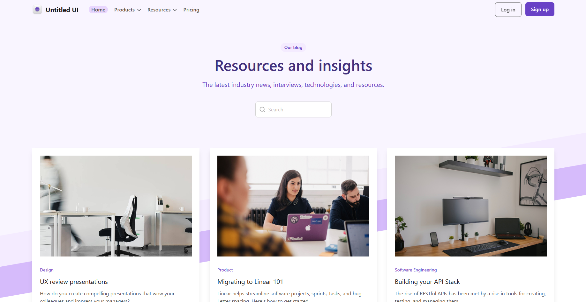

# Blog-SPA Учебный проект по макету Figma

## Ссылка на рабочий сайт развёрнутый через хостинг GitHubPages: [Посмотреть проект] ()

### Untitled UI – FREE Figma UI kit and design system v2.0 - Дизайн разработан и предоставлен в бесплатный доступ автором Jordan Hughes @designer Melbourne, Australia 
* jordanhughes.co
* https://x.com/jordanphughes
* [Ссылка на профиль в Figma](https://www.figma.com/@designer)

***

## 🛠 Технологический стек

 


## Структура проекта

Классический набор файлов, где основой является файл index.html. Два файла для настроек сборки package в формате json. 

В папке /src лежат все файлы скриптов на js и один файл стилей style.css, в котором описаны основные цвета и правила отрисовки. /helpers папка содержит вспомогательный скрипт для форматирования даты.

Папка /public содержит все медиа файлы используемые в проекте.

## Основные возможности

* Можно просматривать содержимое блогов в каталоге без полной перезагрузки страницы

* Живой поиск позволяет находить нужные посты по ключевым словам

* Формы имеют кастомную валидацию

* Имитация ответа от сервера реализованная через всплывающие уведомления вверху у экрана (Тосты)

* В случае ошибок связанных с отсутствием поста по ключевым словам поиска или по неверно переданному id в адресной строке, пользователь увидит текст с уведомлением об ошибке.

## Скриншот главной страницы блога


## Как запустить локально

1. **Клонируйте репозиторий:** 
    ```
    git clone https://github.com/AncientSteal/
    ```

2. **Установить зависимости:**
   (Эта команда создаст папку `node_modules` и скачает туда Tailwind и Lenis)
   ```bash
   npm install
   ```

3. **Запустить проект в режиме разработки:**
   ```bash
   npm run dev
   ```

## Об авторе
<h1 align="center">Здравствуйте, меня зовут <a href="https://daniilshat.ru/" target="_blank">Артур</a> 
</h1>
<h3 align="center">Я начинающий веб-разработчик</h3>
Планирую дальше изучать React, Docker и научится работать со множеством полезных библиотек, в особенности GSAP.
Ссылкb на мои соцсети: 

 


